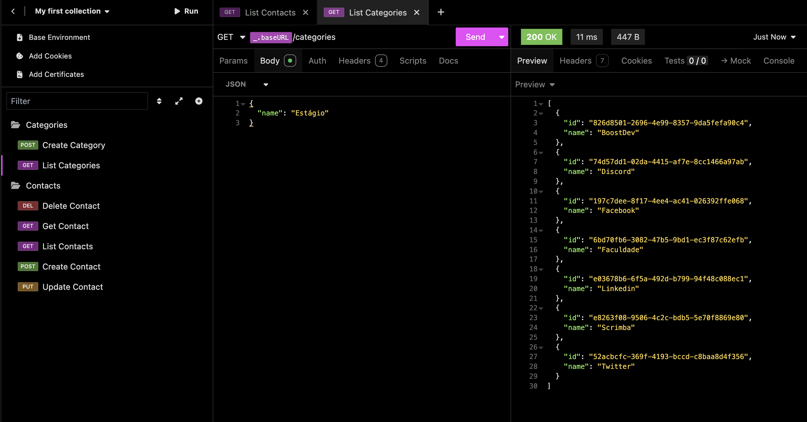

# MyContacts 📇



Um projeto backend desenvolvido em **Node.js** para gerenciar contatos, aplicando conceitos de APIs RESTful, integração com banco de dados **PostgreSQL** e conteinerização com **Docker**.

---

## 📌 Funcionalidades
- **CRUD completo** de contatos (Create, Read, Update, Delete)
- Associação de contatos a categorias
- Organização de código em **Controllers**, **Repositories** e **Routes**
- Tratamento de erros e validações
- Ordenação de resultados

---

## 🛠️ Tecnologias Utilizadas
- **Node.js** com **Express**
- **PostgreSQL**
- **Docker** e **Docker Compose**
- **ESLint** para padronização de código
- **UUID** para geração de IDs
- **Express Async Errors** para tratamento de erros assíncronos

---

## 📂 Estrutura de Pastas
```
src/
├── controllers/   
├── repositories/ 
├── routes/        
├── database/      
└── index.js       
```

---

## 🚀 Como Executar

### 1️⃣ Clone o repositório
```bash
git clone https://github.com/marianaeslan/mycontacts.git
cd mycontacts
```
### 2️⃣ Suba o container com o banco de dados
```bash
docker-compose up -d
```
### 3️⃣ Instale as dependências
```bash
npm install
```
### 4️⃣ Inicie o servidor
```bash
npm run dev
```
A API estará disponível em 
```
http://localhost:3000
```

